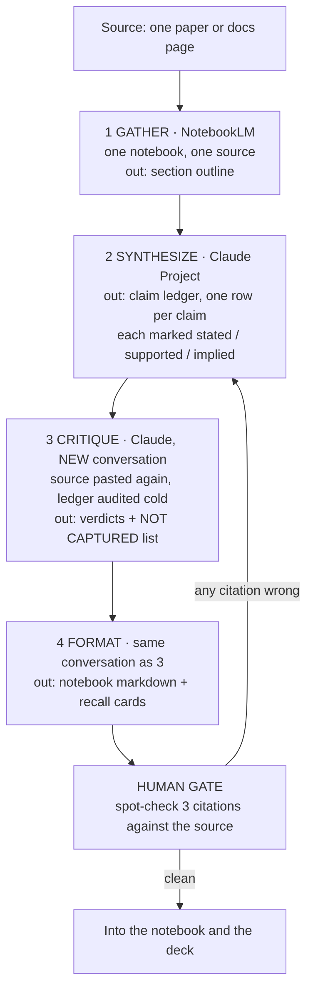

# Ship an Automation Workflow v2 (FL-04)

Emir Cabalak, General AI Fluency track, Week 4

The workflow configuration is in `workflow-config.md` next to this file. Every prompt is there
in full. This document is the walkthrough: the diagram, the five runs, the time accounting, and
where it breaks.

## Which pipeline, and why

Source-grounded study notes.

From my workflow audit, this is the task that eats the most of my week and the one I trust
least. I read a paper or a documentation page on evaluation methodology, and I need two things
out of it: a few paragraphs I can paste into a notebook to justify a method choice, and
something I can actually recall three weeks later. Doing it by hand takes most of an hour per
source and I skip it when I am busy, which is the wrong time to skip it.

Doing it with a single prompt is worse than doing nothing. I tried that for two months. You get
a fluent summary that is roughly right, with citations to sections that do not exist, and you
cannot tell which sentences came from the source and which came from the model's general
knowledge. In a notebook that gets graded, a confident wrong citation is a worse outcome than
no notes at all.

So the pipeline is built around one idea: separate the summarizing from the checking, and make
the checking adversarial.

## The flow

Four steps, and the one that earns its place is step 3.

**Why the critique step is a separate conversation.** The first build had steps 2 and 3 in one
thread. It marked its own ledger fully supported every time, on all five sources. That is not
the model being dishonest, it is the model still holding the reasoning that produced each row,
so of course each row looks justified. Pasting the source fresh into a cold conversation, with
the ledger described as somebody else's work, changed the behavior immediately. On the first
cold run it flagged four rows on a ledger it had itself written twenty minutes earlier.

**Why the sketch changed.** My first sketch had five steps, with a separate "extract quotes"
stage between gather and synthesize. I built it and cut it after two runs. It produced a pile
of quotes with no argument attached, and step 2 then had to reconstruct the argument from
fragments, which it did worse than reading the source directly. The step added twelve minutes
and made the output worse.

## The five runs

Real sources, all public, all on evaluation methodology because that is what my track needs.

| # | Source | Ledger rows | Verdicts from step 3 | Cards kept |
|---|---|---|---|---|
| 1 | scikit-learn user guide, cross-validation chapter | 14 | 11 supported, 2 overstated, 1 garbled, 3 not captured | 9 |
| 2 | Kaufman et al. 2012, Leakage in Data Mining | 23 | 17 supported, 4 overstated, 2 missing, 5 not captured | 16 |
| 3 | scikit-learn API docs, GroupKFold and TimeSeriesSplit | 9 | 9 supported, 0 other, 1 not captured | 6 |
| 4 | Saito and Rehmsmeier 2015, precision-recall vs ROC | 18 | 13 supported, 3 overstated, 2 garbled, 4 not captured | 11 |
| 5 | Zinkevich, Rules of Machine Learning | 31 | 24 supported, 5 overstated, 2 missing, 6 not captured | 14 |

### Run 1, cross-validation chapter

The garbled row is the useful one. Step 2 wrote "GroupKFold ensures the same group does not
appear in both training and test sets." Step 3 caught that the docs actually describe
non-overlapping groups across folds, which is the same thing for a single split and not the
same thing for the full cross-validation loop, and it quoted the line.

Not captured: the caveat about `cross_val_score` refitting the estimator each fold, which
matters for how long my runs take and which I would have missed.

**What went into the notebook.** Three paragraphs on why I use GroupKFold on `client_id`, with
the section cited. The wrong sentence never reached it.

### Run 2, Kaufman on leakage

The most valuable run and the one where the pipeline paid for itself outright.

Two rows came back MISSING. Both were true statements about leakage that are not in this paper,
and I had believed both came from it. One of them I had already half-written into a case study
draft with the paper cited next to it. That is exactly the failure the pipeline exists to
catch, and it caught it on a claim I would have defended in an interview.

The five not-captured rows include the paper's separation of leakage in the features from
leakage in the training examples, which is the distinction my own leakage rule needed and did
not have. My rule was a time-window rule about columns. The paper's framing made me realize the
population filter is the other half, which is now written into case 1.

### Run 3, GroupKFold and TimeSeriesSplit API docs

Nine rows, nine supported, nothing overstated. A clean run.

Worth reporting precisely because it is boring. API reference pages are short, declarative, and
make few claims, so the critique step has nothing to find. If every run looked like this the
pipeline would not be worth its setup cost. Knowing which sources it helps on is part of the
result: it pays off on argumentative sources and it is overhead on reference pages.

### Run 4, precision-recall vs ROC

Three overstated rows, all the same mistake in different clothes. Step 2 kept turning "PR
curves are more informative for imbalanced data" into "ROC is misleading for imbalanced data."
The paper does not say ROC is misleading. It says PR is more informative for this purpose,
which is a weaker and different claim, and step 3 caught all three with the weaker phrasing
quoted.

This is the hedge-drift failure and it is the most common one across all five runs. The model
does not invent claims very often. It routinely strengthens them by one notch.

### Run 5, Rules of Machine Learning

Thirty-one rows, the longest source, and the run where the pipeline strained. Step 2's ledger
started strong and got thinner toward the end: the last third of the rows were vaguer and two
of the missing verdicts were in that stretch. Long sources need splitting, and I now cut
anything over roughly 6,000 words into halves and run them separately.

Fourteen cards out of thirty-one rows because most of this document is advice I agree with and
do not need to memorize.

### The end-to-end check on a new input

Run 6, done after the five, on a source the pipeline had never seen: the scikit-learn page on
permutation feature importance. It ran end to end with no intervention: 12 rows, 10 supported,
1 overstated, 1 garbled, 2 not captured, 7 cards. The overstated row was another hedge drift,
"permutation importance is unreliable with correlated features" from a source that says the
results can be misleading. Same failure mode as run 4, caught the same way.

## Time accounting, honestly

**Setup.** 3 hours 40 minutes, and it was not smooth. Roughly:

- 25 min sketching, including the five-step version I threw away
- 40 min building the first version and running it on source 1
- 50 min discovering the self-audit problem and rebuilding step 3 as a cold conversation
- 35 min on the extraction step that got deleted, which is time I do not get back
- 30 min tightening the step 2 prompt after the ledger kept merging related claims
- 40 min on the step 4 card format, which took three tries to stop producing cards that
  define things I already know

**Manual baseline.** I timed myself doing this by hand on source 4, the precision-recall paper,
before building anything. 55 minutes, and that produced notes with no citations and no cards,
so it is a generous baseline for the manual side rather than a fair one.

**Per-run with the pipeline.** Measured across the five runs, including my own reading and the
human gate:

| | best | worst | median |
|---|---|---|---|
| step 1 gather | 3 min | 6 min | 4 min |
| step 2 synthesize | 2 min | 4 min | 3 min |
| step 3 critique | 2 min | 5 min | 3 min |
| step 4 format | 1 min | 2 min | 2 min |
| human gate and fixes | 4 min | 14 min | 7 min |
| **total** | **12 min** | **31 min** | **19 min** |

**So: 55 minutes manual against 19 minutes median. About 36 minutes saved per source.**

Now the part that makes the number honest. Setup was 220 minutes. At 36 minutes saved per
source, break-even is source number 6.1. I ran five for this assignment, so **at the moment I
submitted this, the pipeline had not paid for itself yet.** It went positive on run 6, the
end-to-end check, and it is roughly 40 minutes ahead as of writing.

I could present a bigger number by quoting the 36 minutes alone and leaving setup out, or by
using the worst manual run as the baseline. Both would be true sentences and both would be
misleading, and this whole track is me arguing that I do not do that.

The other thing the raw number hides: the output is not the same output. The manual notes had
no citations. Run 2 caught two claims I had attributed to a paper that does not contain them.
There is no minutes-saved figure for that, and it is the reason I keep using the pipeline
rather than the 36 minutes.

## Where it breaks

**Hedge drift is the standing failure.** It appeared in three of five runs and in the new-input
check. Step 2 strengthens claims by a notch, step 3 usually catches it, and "usually" is doing
real work in that sentence. I do not have a run where I can prove step 3 caught all of them,
because to know that I would have to do the whole thing by hand, which is the task I automated.

**Step 3 grades the ledger, not the source.** If step 2 misses a claim entirely and step 3 does
not list it under NOT CAPTURED, it is gone and nothing downstream will ever notice. The
not-captured list is the least verifiable output in the pipeline and the one I lean on most.

**Long sources degrade.** Over roughly 6,000 words the ledger thins out toward the end. Split
them. I found this on run 5 and only because the pattern was visually obvious in the table.

**Reference pages are not worth it.** Run 3 cost 12 minutes to confirm that a docs page says
what it says. For API references I now read the page.

**NotebookLM will answer about a source it does not have.** Once, on run 2, I asked a follow-up
that drifted off the document and got a fluent answer from general knowledge with no indication
it had left the source. Source grounding is a strong default, not a wall.

**Paywalls and PDFs.** Two of my five went in cleanly. Scanned PDFs with two-column layouts
scramble on paste and the ledger inherits the scramble. Nothing in the pipeline detects this.

## What a human must still check

Three things, every run, no exceptions. This is the gate in the diagram and skipping it removes
the point of the pipeline.

**Three citations, opened in the source.** Not read for meaning, just located. I pick the first
one, the last one, and one at random. If any of the three does not exist where it says, the
whole ledger goes back to step 2, because a pipeline that gets one location wrong has no reason
to have got the others right. This has triggered twice in six runs.

**Every OVERSTATED verdict, read against the quoted original.** Step 3 quotes the weaker
version, so this is quick, and it is where I actually learn the source. Two of the three
overstated rows in run 4 changed how I would describe PR curves out loud.

**The NOT CAPTURED list, read as a list of questions rather than answers.** Each item is the
model claiming the source says something the ledger missed. That claim is unverified. I check
the ones that would change a method decision and I let the rest go, and I know that letting
them go is a choice with a cost.

What I no longer check by hand: the card wording, the notebook paragraph phrasing, and the
section outline from step 1. Six runs in, those have not been wrong in a way that mattered.
That list is written in pencil.
